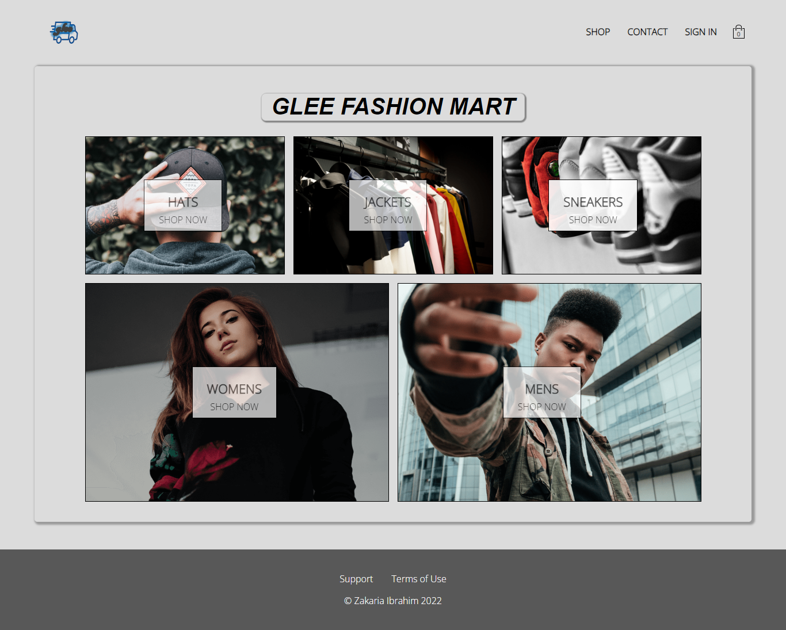
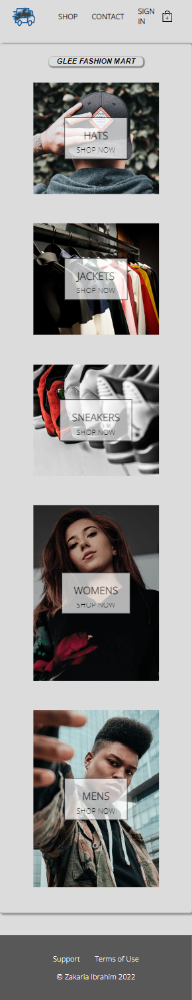
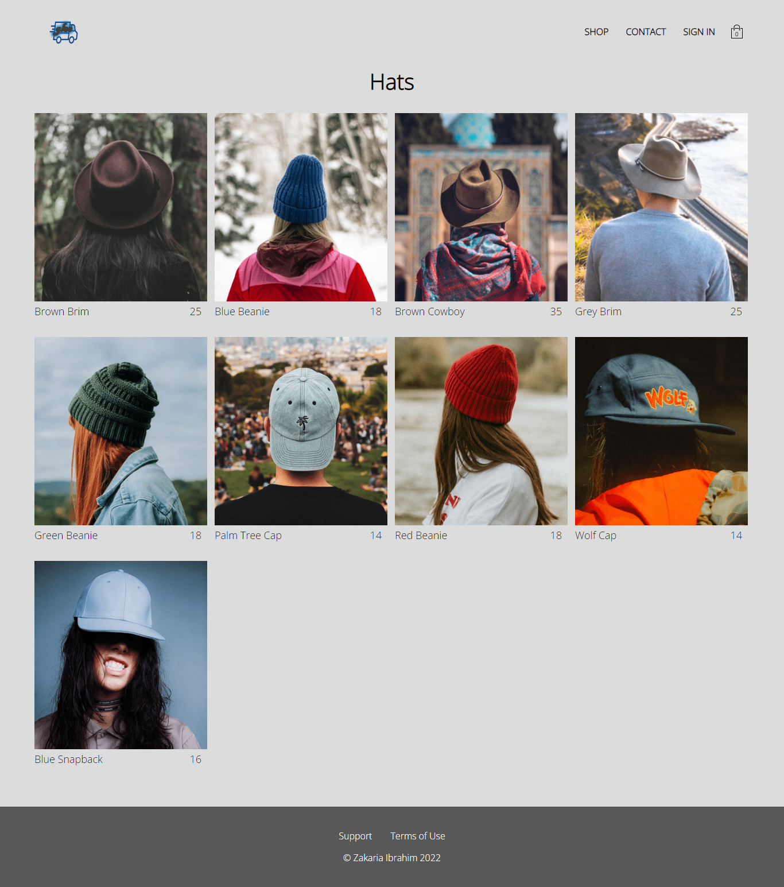
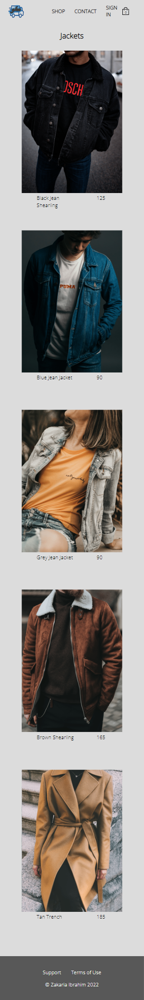
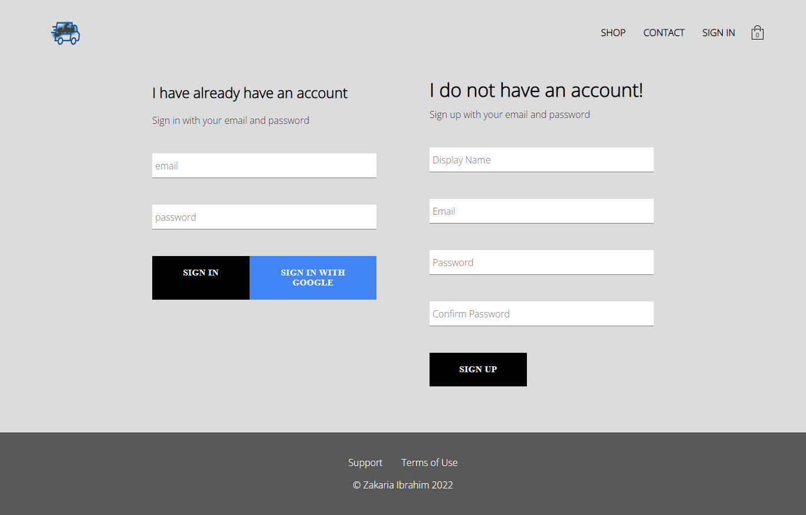

This project is a comprehensive approach to build a complete e-commerce website based on ReactJS framework. Also includes some packages suitable for ReactJS ecosystem like redux, react-redux, node-sass, redux-logger, redux-persist, react-stripe-checkout (for Stripe payment integration), firebase (firestore+auth) and so on.
  
Live URL: [glee-fashion-mart-bd.netlify.app](https://glee-fashion-mart-bd.netlify.app/)
  
#Home page - desktop view:
  

  
#Home page - mobile view:
  

  
#Some more pages:
  

  

  

  

  